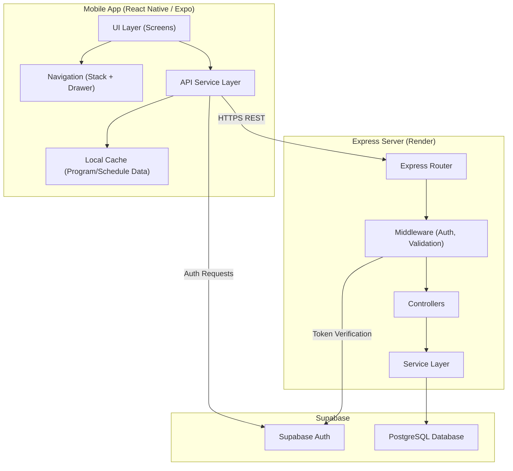
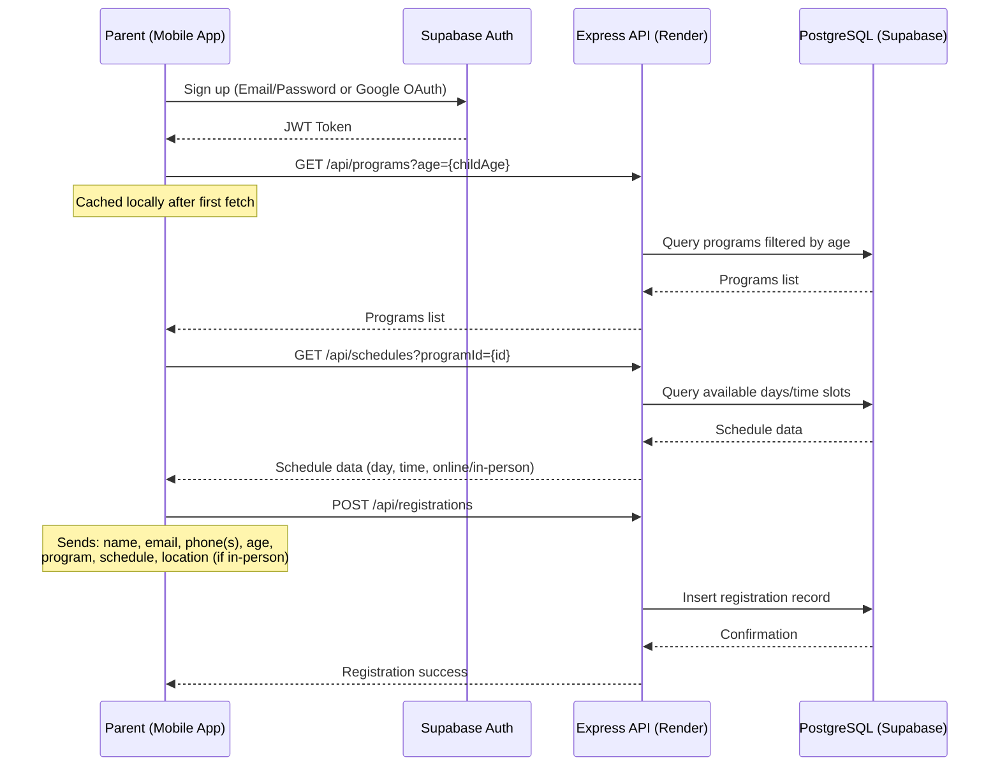
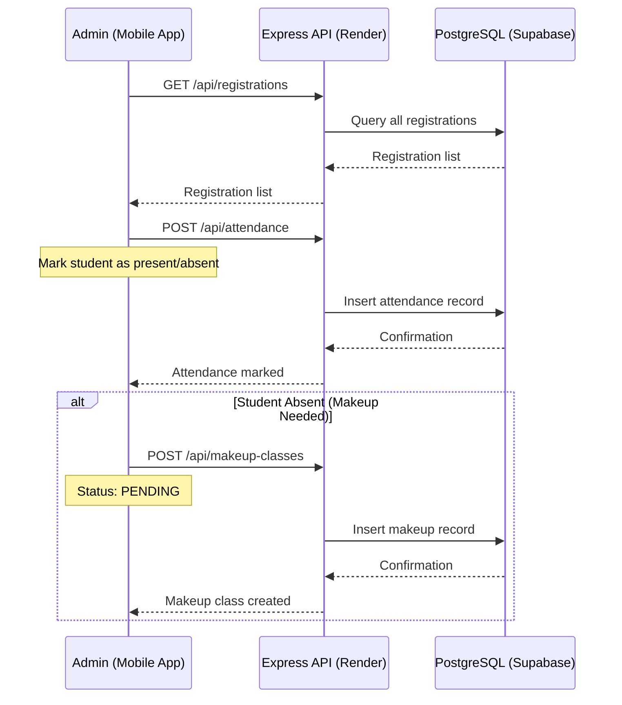
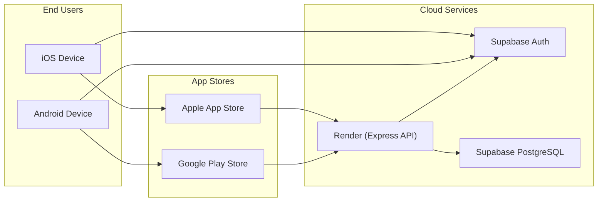

# System Architecture — Student Registration App

## 1. Overview

The Student Registration App is a production-ready POC that enables **parents** to register their children for programs/courses, and **admins** to view registrations, manage schedules, and track attendance. It is built as a cross-platform mobile application targeting both iOS and Android.

---

## 2. Tech Stack

| Layer | Technology | Purpose |
|---|---|---|
| **Mobile Client** | React Native | Cross-platform iOS & Android app |
| **Navigation** | React Navigation v7 (Stack + Drawer) | In-app routing and screen management |
| **Backend API** | Node.js + Express.js | REST API server, business logic |
| **Database** | PostgreSQL (via Supabase) | Persistent data storage |
| **Authentication** | Supabase Auth | Email/Password + Google OAuth |
| **API Hosting** | Render | Express server deployment |
| **DB Hosting** | Supabase | Managed PostgreSQL instance |
| **App Distribution** | Apple App Store / Google Play Store | End-user delivery |

---

## 3. High-Level Architecture



---

## 4. Project Structure (Proposed)

```
student-registration-coop/
├── client/                     # React Native (Expo) mobile app
│   ├── src/
│   │   ├── assets/             # Static assets (images, fonts)
│   │   ├── components/         # Reusable UI components
│   │   ├── navigation/         # Stack & Drawer navigators
│   │   ├── screens/            # Screen-level components
│   │   ├── services/           # API client & Supabase SDK calls
│   │   ├── cache/              # Client-side caching logic
│   │   ├── styles/             # Global styles and theme
│   │   ├── utils/              # Helper functions
│   │   └── App.js              # Entry point
│   └── package.json
│
├── server/                     # Express.js backend (NEW)
│   ├── src/
│   │   ├── config/             # DB connection, env config
│   │   ├── middleware/         # Auth, validation, error handling
│   │   ├── routes/             # Route definitions
│   │   ├── controllers/       # Request handlers
│   │   ├── services/          # Business logic
│   │   ├── models/            # Data access layer
│   │   └── app.js             # Express app setup
│   ├── package.json
│   └── .env.example
│
├── database/
│   └── schema.sql              # PostgreSQL schema
│
└── docs/                       # System design documents
    ├── architecture.md
    ├── db-schema.md
    ├── api-endpoints.md
    ├── auth-flow.md
    ├── registration-flow.md
    └── attendance.md
```

---

## 5. Data Flow

### 5.1 Parent Registration Flow



### 5.2 Admin Attendance Flow



---

## 6. Deployment Topology



**Deployment summary:**
- **Mobile App** → Built with Expo EAS, published to App Store & Google Play
- **Express API** → Deployed on Render (free/starter tier for POC)
- **Database** → Supabase managed PostgreSQL (free tier for POC)
- **Auth** → Supabase Auth (handles OAuth + email/password, free tier)

---

## 7. Client-Side Caching Strategy

Since program/schedule data changes **rarely**, the client caches this data to minimize API calls:

| Data | When to fetch | Cache duration |
|---|---|---|
| Programs (by age) | On registration form open | Until app restart or manual refresh |
| Schedules (by program) | On program selection | Until app restart or manual refresh |
| Locations | On registration form open | Until app restart or manual refresh |

The cache layer sits in `client/src/cache/` and uses in-memory storage. If the app is restarted, data is re-fetched.

---

## 8. Security Considerations (POC Level)

- All API requests authenticated via **Supabase JWT tokens** passed in `Authorization` header
- Express middleware **verifies tokens** with Supabase before processing requests
- **Role-based access**: middleware checks user role (parent vs admin) per endpoint
- HTTPS enforced on Render and Supabase (default)
- Admin accounts are **seeded** initially (max 5), not self-registered
