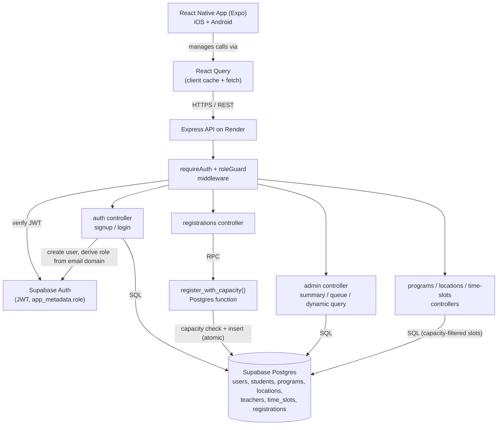
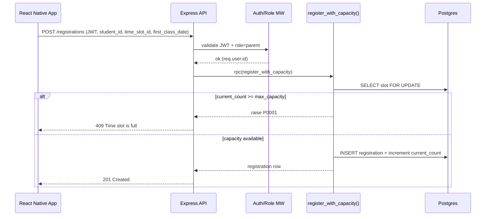

# System Design Architecture — Student Registration App (POC)

## Context
This is a POC for a **tutoring academy** student registration mobile app (iOS + Android). Parents register students into tutoring programs with fixed time slots. Admin reviews and approves registrations. Faculty features are out of POC scope.

---

## 1. Functional Requirements

### Authentication
- Role-based auth: **Admin** and **Parent** for POC
- Future roles: Student, Faculty (not in POC)
- **Role is derived from the email domain** at signup: emails on the **`sc4k.ca`** domain → `admin`; any other domain → `parent`. Single signup/login flow; no separate admin login, no invite/setup-password step. The mechanism is invisible to users.

#### Role Routing
1. **Signup (server):** the auth controller inspects the email domain and sets `app_metadata.role` (`admin` for `@sc4k.ca`, else `parent`) when creating the Supabase user via the service-role key. `app_metadata` is server-only — clients cannot set or alter it.
2. **Token:** Supabase mints the JWT with `role` embedded in `app_metadata`; `requireAuth` reads it on every request and `roleGuard` enforces it.
3. **Redirect (client):** after login the app reads `role` from the session and routes `admin` → admin dashboard, `parent` → registration form. This is a local token read with no extra round trip, so it is transparent and immediate to the user.

### Admin Features
- **Home view:** count of currently-enrolled students + count of pending/received registrations awaiting approval.
- **Dynamic filtering:** admin can view any DB columns combined arbitrarily at any time (preset axes: program / teacher / location-in-person / online). The tabular views below are default presets, not the only views:

| View | Data Shown | Query Path |
|------|-----------|------------|
| Students list | Student name, enrolled program, age, parent contact | `students` → `registrations` → `programs` |
| Teachers list | Teacher name, courses, time slots | `teachers` → `time_slots` → `programs` |
| Teacher → Students | Which teacher has which students, on what days, with contact details | `teachers` → `time_slots` → `registrations` → `students` |
| Program details | Name, level, age range, description, slot counts | `programs` → `time_slots` |
| Registrations queue | Pending registrations to approve/reject | `registrations` WHERE pending → `students` → `time_slots` |

- Manage programs, time slots, locations, and teachers (CRUD)

### Parent Features
- Register one or more children
- Registration form per child:
  - Student name *(required)*
  - Parent email *(required)*
  - Parent phone number *(required)*
  - Age *(required)*
  - Program selection *(required)*
  - Mode: Online / In-person (dropdown) *(required)*
    - If in-person → select location (dropdown)
  - Selected time slot, filtered by program + mode + location
    - Slots that are full (5/5) are not shown
  - Selected date for the first class *(required)*

### Cascading Selection Logic
The form is strictly dependent — each step filters the next:
1. Select **program** →
2. show **modes** available for that program →
3. (if in-person) show **locations** for that program/mode →
4. show the **next available calendar date(s)** →
5. show **available time slots** for that date (slots at 5/5 are hidden).

### Scheduling & Capacity
- Admin pre-defines fixed time slots per program, per day, per mode/location
- Each slot has a max capacity of **5 students**
- A `current_count` field on each slot tracks active headcount (pending + approved registrations)
- If `current_count >= 5`, the slot is unavailable for new registrations

### Post-Registration Flow
- Admin reviews upon getting the request
- Admin reaches out to parent (outside of the app)

---

## 2. Non-Functional Requirements

| Requirement | Target |
|---|---|
| **Platform** | iOS + Android (React Native) |
| **Availability** | Standard — single-region deployment acceptable for POC |
| **Latency** | ≤ 200ms for database queries |
| **Security** | JWT-based auth, HTTPS, Supabase-managed auth (no app-side bcrypt), role-based access control |
| **Scalability** | 100 MAU + ~30 concurrent users; schema designed to scale later |
| **Data Integrity** | Capacity checks must be atomic to prevent overbooking |

---

## 3. Tech Stack

| Layer | Technology | Notes |
|-------|-----------|-------|
| **Frontend** | React Native (Expo) | Cross-platform iOS + Android |
| **State Management** | React Query | Pairs well with Supabase for data fetching/caching |
| **Backend/API** | Node.js (Express) | Handles all CRUD operations, business logic, and capacity checks |
| **Database** | PostgreSQL (Supabase) | Supabase as hosted Postgres provider; CRUD queries go through the Node.js API |
| **Authentication** | Supabase Auth | Handles sign-up, login, session management, JWT issuance for both client and server. The Node API validates Supabase JWTs in middleware via `supabase.auth.getUser(token)` and reads `role` from the user's `app_metadata`. `users.id` mirrors `auth.uid()` so RLS policies can key off `auth.uid()` directly. |
| **Build & Deploy** | EAS Build (Expo) | Generates iOS + Android binaries for App Store / Google Play |
| **API Hosting** | Render | Hosts the Node.js Express server |

---

## 4. High-Level Design


```mermaid
graph TD
    App["React Native App (Expo)<br/>iOS + Android"]
    RQ["React Query<br/>(client cache + fetch)"]
    API["Express API on Render"]
    MW["requireAuth + roleGuard<br/>middleware"]
    AuthC["auth controller<br/>signup / login"]
    RegC["registrations controller"]
    AdminC["admin controller<br/>summary / queue / dynamic query"]
    ReadC["programs / locations / time-slots<br/>controllers"]
    SAuth["Supabase Auth<br/>(JWT, app_metadata.role)"]
    RPC["register_with_capacity()<br/>Postgres function"]
    DB[("Supabase Postgres<br/>users, students, programs, locations,<br/>teachers, time_slots, registrations")]

    App -->|"manages calls via"| RQ
    RQ -->|"HTTPS / REST"| API
    API --> MW
    MW -->|"verify JWT"| SAuth
    MW --> AuthC
    MW --> RegC
    MW --> AdminC
    MW --> ReadC
    AuthC -->|"create user, derive role from email domain"| SAuth
    RegC -->|"RPC"| RPC
    RPC -->|"capacity check + insert (atomic)"| DB
    AdminC -->|"SQL"| DB
    ReadC -->|"SQL (capacity-filtered slots)"| DB
    AuthC -->|"SQL"| DB
```

### Critical Flow — Parent Registration (capacity-checked)


```mermaid
sequenceDiagram
    participant App as React Native App
    participant API as Express API
    participant MW as Auth/Role MW
    participant RPC as register_with_capacity()
    participant DB as Postgres

    App->>API: POST /registrations (JWT, student_id, time_slot_id, first_class_date)
    API->>MW: validate JWT + role=parent
    MW-->>API: ok (req.user.id)
    API->>RPC: rpc(register_with_capacity)
    RPC->>DB: SELECT slot FOR UPDATE
    alt current_count >= max_capacity
        RPC-->>API: raise P0001
        API-->>App: 409 Time slot is full
    else capacity available
        RPC->>DB: INSERT registration + increment current_count
        RPC-->>API: registration row
        API-->>App: 201 Created
    end
```

### API Endpoints (Key)

| Method | Endpoint | Role | Description |
|--------|----------|------|-------------|
| POST | `/auth/signup` | Public | Sign-up; role auto-derived from email domain |
| POST | `/auth/login` | Public | Login (returns JWT); client routes by role |
| GET | `/programs` | Any | List all programs |
| GET | `/locations` | Any | List all locations |
| GET | `/time-slots?program_id=&mode=&location_id=&date=` | Any | Available slots; **excludes slots at capacity (≥5)**; supports next-available-date logic |
| POST | `/students` | Parent | Create a child for the authenticated parent. Body: `student_name` (req), `age` (req), `parent_email` (req), `parent_phone` (req). `parent_id` is set server-side from `auth.uid()`. Returns 201 with the new row, 400 on missing required fields, 403 if not a parent. *(Note: current code deviates — see backend-report.md C-1; fix deferred to code phase.)* |
| POST | `/registrations` | Parent | Submit a registration (incl. `first_class_date`). Implemented via `supabase.rpc('register_with_capacity', ...)` so the capacity check + counter increment happen atomically inside Postgres. Returns 409 when `current_count >= max_capacity`. |
| GET | `/registrations/my` | Parent | View own registrations + status |
| GET | `/admin/summary` | Admin | Home view: currently-enrolled count + pending count |
| GET | `/admin/students` | Admin | All students with program + parent info |
| GET | `/admin/teachers` | Admin | All teachers with their courses + slots |
| GET | `/admin/teachers/:id/students` | Admin | Students under a specific teacher, by day, with contact details |
| GET | `/admin/programs/:id` | Admin | Program detail with slot counts |
| GET | `/admin/registrations` | Admin | Pending registrations queue |
| PATCH | `/admin/registrations/:id` | Admin | Approve or reject a registration |
| POST | `/admin/programs` | Admin | Create program |
| POST | `/admin/time-slots` | Admin | Create time slot |
| POST | `/admin/teachers` | Admin | Add teacher |
| GET | `/admin/query` (dynamic) | Admin | Filterable view over arbitrary combinable columns; preset axes: program / teacher / location-in-person / online |

---

## 5. Database Schema

### `users`
| Column | Type | Constraints | Notes |
|--------|------|-------------|-------|
| id | UUID | PK | |
| email | VARCHAR(255) | UNIQUE, NOT NULL | Login email |
| (password) | — | — | Managed by Supabase Auth; no app-side `password_hash` column |
| role | ENUM('admin','parent') | NOT NULL | Expandable later |
| name | VARCHAR(255) | NOT NULL | |
| phone_number | VARCHAR(20) | NULL | Required for parents |
| created_at | TIMESTAMP | NOT NULL, DEFAULT NOW | |
| updated_at | TIMESTAMP | NOT NULL, DEFAULT NOW | |

### `students`
| Column | Type | Constraints | Notes |
|--------|------|-------------|-------|
| id | UUID | PK | |
| parent_id | UUID | FK → users.id, NOT NULL | |
| student_name | VARCHAR(255) | NOT NULL | **Required** |
| age | INT | NOT NULL | **Required** |
| parent_email | VARCHAR(255) | NOT NULL | **Required** |
| parent_phone | VARCHAR(20) | NOT NULL | **Required** |
| created_at | TIMESTAMP | NOT NULL, DEFAULT NOW | |
| updated_at | TIMESTAMP | NOT NULL, DEFAULT NOW | |

> One parent (user) can have multiple students (children).

### `programs`
| Column | Type | Constraints | Notes |
|--------|------|-------------|-------|
| id | UUID | PK | |
| name | VARCHAR(255) | NOT NULL | e.g., "Python Programming" |
| level | ENUM('beginner','intermediate','advanced') | NOT NULL | |
| target_age | VARCHAR(50) | NOT NULL | e.g., "8-12" or "13-17" |
| description | TEXT | NULL | About the program |
| prerequisites | TEXT | NULL | What's needed before enrolling |
| status | ENUM('active','inactive') | NOT NULL, DEFAULT 'active' | |
| created_at | TIMESTAMP | NOT NULL, DEFAULT NOW | |
| updated_at | TIMESTAMP | NOT NULL, DEFAULT NOW | |

### `locations`
| Column | Type | Constraints | Notes |
|--------|------|-------------|-------|
| id | UUID | PK | |
| name | VARCHAR(255) | NOT NULL | e.g., "Main Campus" |
| address | VARCHAR(500) | NULL | |
| created_at | TIMESTAMP | NOT NULL, DEFAULT NOW | |

### `teachers`
| Column | Type | Constraints | Notes |
|--------|------|-------------|-------|
| id | UUID | PK | |
| name | VARCHAR(255) | NOT NULL | |
| email | VARCHAR(255) | UNIQUE, NULL | |
| phone_number | VARCHAR(20) | NULL | |
| created_at | TIMESTAMP | NOT NULL, DEFAULT NOW | |
| updated_at | TIMESTAMP | NOT NULL, DEFAULT NOW | |

### `time_slots`
| Column | Type | Constraints | Notes |
|--------|------|-------------|-------|
| id | UUID | PK | |
| program_id | UUID | FK → programs.id, NOT NULL | |
| teacher_id | UUID | FK → teachers.id, NULL | Enables teacher-course joins |
| location_id | UUID | FK → locations.id, NULL | NULL = online |
| mode | ENUM('online','in-person') | NOT NULL | |
| day_of_week | ENUM('mon','tue','wed','thu','fri','sat','sun') | NOT NULL | |
| start_time | TIME | NOT NULL | e.g., 17:00 |
| end_time | TIME | NOT NULL | e.g., 18:00 |
| max_capacity | INT | NOT NULL, DEFAULT 5 | |
| current_count | INT | NOT NULL, DEFAULT 0 | Active headcount (pending + approved) |
| created_at | TIMESTAMP | NOT NULL, DEFAULT NOW | |
| updated_at | TIMESTAMP | NOT NULL, DEFAULT NOW | |

> **Capacity rule**: slot is unavailable when `current_count >= max_capacity`.
> `current_count` is incremented on new registration + enrolled, decremented on rejection/cancellation.

### `registrations`
| Column | Type | Constraints | Notes |
|--------|------|-------------|-------|
| id | UUID | PK | |
| student_id | UUID | FK → students.id, NOT NULL | |
| program_id | UUID | FK → programs.id, NOT NULL | |
| time_slot_id | UUID | FK → time_slots.id, NOT NULL | |
| first_class_date | DATE | NOT NULL | Date of the first class (chosen on the form) |
| status | ENUM('pending','approved','rejected') | NOT NULL, DEFAULT 'pending' | |
| submitted_at | TIMESTAMP | NOT NULL, DEFAULT NOW | |
| reviewed_at | TIMESTAMP | NULL | |
| reviewed_by | UUID | FK → users.id, NULL | Admin who reviewed |
| created_at | TIMESTAMP | NOT NULL, DEFAULT NOW | |
| updated_at | TIMESTAMP | NOT NULL, DEFAULT NOW | |

> **Unique constraint**: (student_id, time_slot_id) — prevents duplicate registration to same slot.
> On INSERT: increment `time_slots.current_count`. On reject: decrement.

---

### ER Relationships Summary

```
users (parent) ──1:N──▶ students
students ──1:N──▶ registrations
programs ──1:N──▶ time_slots
teachers ──1:N──▶ time_slots
locations ──1:N──▶ time_slots
time_slots ──1:N──▶ registrations
programs ──1:N──▶ registrations
users (admin) ──1:N──▶ registrations (reviewed_by)
```

---

## 6. Database Setup

Two SQL artifacts must be applied to the Supabase project **in order**, before the API works:

| # | File | Purpose |
|---|------|---------|
| 1 | [schema.sql](../server/db/schema.sql) | Full DDL — enums + all 7 tables (`users`, `programs`, `locations`, `teachers`, `students`, `time_slots`, `registrations`), constraints, and indexes. |
| 2 | [register_with_capacity.sql](../server/db/register_with_capacity.sql) | `register_with_capacity(p_student_id, p_program_id, p_time_slot_id, p_first_class_date)` Postgres function. Atomically validates slot capacity, inserts the registration, and increments `time_slots.current_count`. Called by `POST /registrations`. |
| 3 | [review_registration.sql](../server/db/review_registration.sql) | `review_registration(p_registration_id, p_status, p_reviewer_id)` Postgres function. Atomically sets the registration status/reviewer and decrements `time_slots.current_count` on the first transition into `rejected`. Called by `PATCH /admin/registrations/:id`. |
---

## 7. Verification

- Review schema covers all form fields from the registration flow
- Confirm capacity logic: `current_count` on `time_slots` accurately reflects pending + approved registrations
- Admin can query teacher-course relationships via `time_slots.teacher_id` JOIN `teachers`
- Admin can query student-teacher relationships via `registrations` → `time_slots` → `teachers`
- One parent can register multiple children (1:N users → students)
- One student enrolls in one program at a time (one registration active per student)
