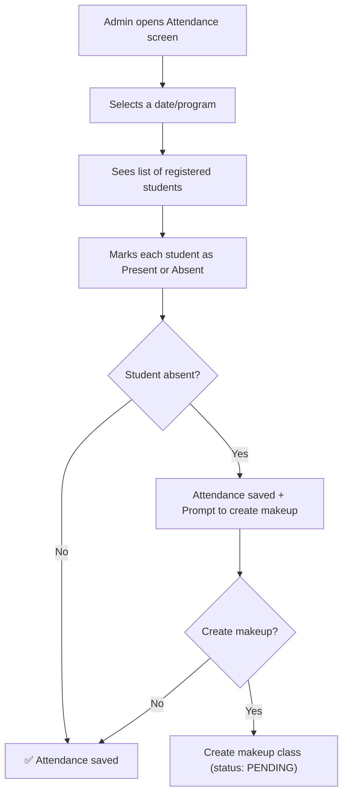
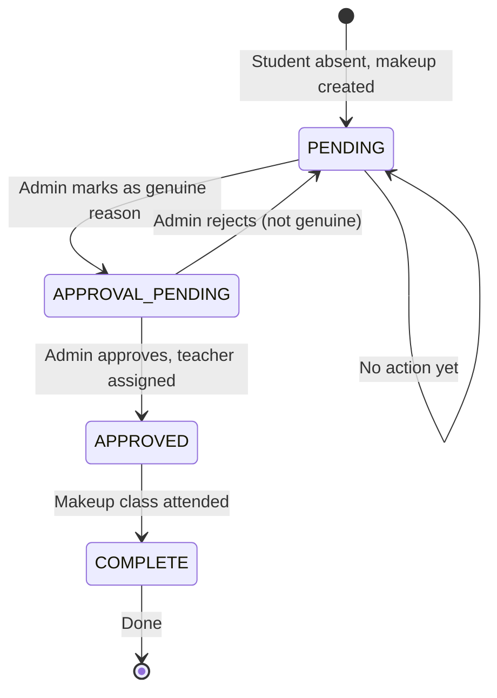
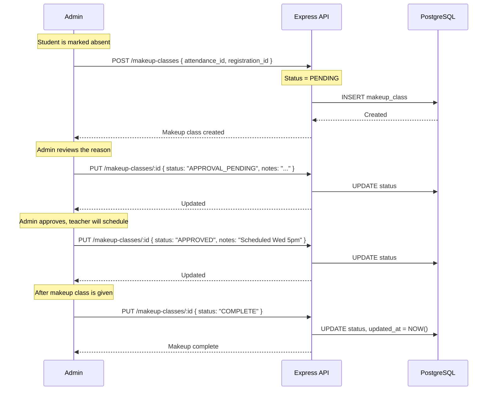

# Attendance & Makeup Class Workflow — Student Registration App

## 1. Overview

This document covers how attendance is tracked for registered students and how makeup (cover-up) classes are managed when students miss their scheduled sessions. All attendance operations are **admin-only**.

---

## 2. Attendance Tracking

### 2.1 How it works

- Each student has **one scheduled time slot** per program (set during registration)
- The admin marks attendance for each class date
- Attendance is recorded as **present** or **absent**

### 2.2 Attendance Flow



### 2.3 Attendance Data Model

Each attendance record captures:

| Field | Description |
|---|---|
| `registration_id` | Which student + program |
| `class_date` | The date of the class session |
| `is_present` | `true` / `false` |
| `notes` | Optional admin notes (e.g., reason for absence) |
| `marked_at` | Timestamp of when attendance was recorded |

### 2.4 Attendance Summary

For each student registration, the system provides a summary:

```
Total Classes:    10
Present:          8
Absent:           2
Attendance Rate:  80%
Pending Makeups:  1
Completed Makeups: 1
```

---

## 3. Makeup (Cover-Up) Class Workflow

### 3.1 Business Rules

| Rule | Description |
|---|---|
| **Trigger** | A makeup class is created when a student is marked absent |
| **Ratio** | 1 missed class = 1 makeup class |
| **Eligibility** | Admin decides (genuine reason / 24-hour prior notice) |
| **Assignment** | Admin manually changes the status; teacher gives the class |
| **Limit** | No explicit limit — one makeup per absence |

### 3.2 Status Lifecycle



### 3.3 Status Definitions

| Status | Meaning | Who transitions | Next Steps |
|---|---|---|---|
| `PENDING` | Student was absent, makeup not yet evaluated | System (auto-created) | Admin reviews the reason |
| `APPROVAL_PENDING` | Admin determined genuine reason | Admin | Admin decides whether to approve |
| `APPROVED` | Approved for makeup; teacher will schedule | Admin | Teacher gives the makeup class |
| `COMPLETE` | Makeup class has been completed | Admin | (end state) |

### 3.4 Makeup Class Flow



---

## 4. Admin Views

### 4.1 Attendance View

The admin needs to see:

| View | Description | API Endpoint |
|---|---|---|
| **By Date** | All students in a program for a specific date | `GET /attendance?date=2026-03-08&program_id=uuid` |
| **By Student** | Full attendance history for one student | `GET /attendance/:registrationId` |
| **Summary** | Attendance percentage + makeup count | Computed in the attendance response |

### 4.2 Makeup Classes View

The admin needs to see:

| View | Description | API Endpoint |
|---|---|---|
| **All Pending** | Makeups awaiting action | `GET /makeup-classes?status=PENDING` |
| **All Approved** | Makeups scheduled, awaiting completion | `GET /makeup-classes?status=APPROVED` |
| **By Student** | All makeups for a specific student | `GET /makeup-classes?registration_id=uuid` |
| **All** | Full list with filters | `GET /makeup-classes` |

---

## 5. Edge Cases

| Case | Behavior |
|---|---|
| Admin marks student absent twice for the same date | Backend returns `409 Conflict` (unique constraint on `registration_id + class_date`) |
| Makeup created for a date where student was actually present | Admin must first correct the attendance record, which cascades to delete the makeup |
| Admin skips `APPROVAL_PENDING` and goes straight to `APPROVED` | Allowed — the status flow is recommended but `PENDING → APPROVED` is a valid transition |
| Multiple absences | Each absence generates its own independent makeup class record |
