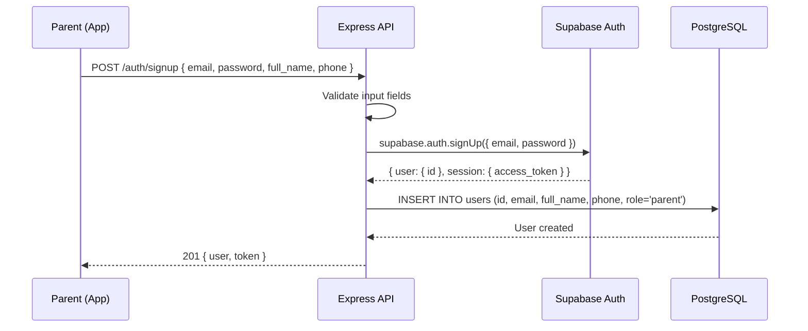
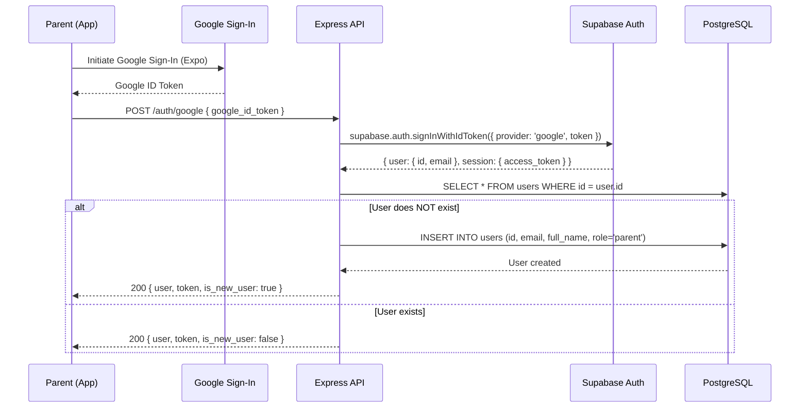
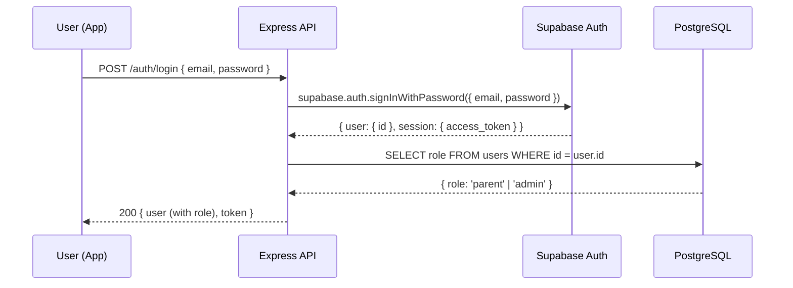

# Authentication & Authorization Flow — Student Registration App

## 1. Overview

Authentication is handled by **Supabase Auth**, which manages user credentials, sessions, and JWT tokens. The Express backend verifies tokens and enforces role-based access control.

| Auth Provider | Supported Roles |
|---|---|
| Email / Password | Parent, Admin |
| Google OAuth | Parent, Admin |

---

## 2. Roles & Permissions

| Permission | Parent | Admin |
|---|---|---|
| Sign up (self-register) | ✅ | ❌ (seeded only) |
| Login | ✅ | ✅ |
| View/fill registration form | ✅ | ❌ |
| Create student records | ✅ | ❌ |
| View own registrations | ✅ | ❌ |
| View all registrations | ❌ | ✅ |
| Manage programs/schedules | ❌ | ✅ |
| Mark attendance | ❌ | ✅ |
| Manage makeup classes | ❌ | ✅ |

---

## 3. Authentication Flows

### 3.1 Parent Sign-Up (Email/Password)



**Key points:**
- The `users.id` matches the Supabase Auth `auth.users.id`
- Role is always `parent` for self-registered users
- Password hashing is handled entirely by Supabase Auth

---

### 3.2 Parent Sign-Up (Google OAuth)



**Key points:**
- Google Sign-In is handled by Expo's Google Auth package on the client
- The client sends the Google ID token to the Express API
- The Express API uses Supabase's `signInWithIdToken` to verify and create/link the user

---

### 3.3 Login (Email/Password)



**Post-login routing:**
- If `role === 'parent'` → Navigate to Registration Form
- If `role === 'admin'` → Navigate to Admin Dashboard

---

### 3.4 Admin Login

Admin login uses the **same** login endpoints (email/password or Google OAuth). The difference is:
- Admin accounts are **pre-seeded** in both Supabase Auth and the `users` + `admins` tables
- The `role` field in `users` is set to `admin`
- The Express middleware detects the admin role and grants elevated permissions

---

## 4. Token Management

### 4.1 JWT Structure

Supabase issues JWTs containing:
```json
{
  "sub": "user-uuid",
  "email": "user@example.com",
  "role": "authenticated",
  "aud": "authenticated",
  "exp": 1709942400
}
```

### 4.2 Token Lifecycle

| Event | Action |
|---|---|
| Login/Signup | Supabase returns `access_token` + `refresh_token` |
| API Request | Client sends `access_token` in `Authorization: Bearer <token>` header |
| Token Expiry | Client uses `refresh_token` to get a new `access_token` via Supabase SDK |
| Logout | Client calls Supabase `signOut()`, tokens are invalidated |

### 4.3 Client-Side Token Storage

Tokens are stored securely on the device using Expo's `SecureStore` (encrypted key-value storage). The Supabase client SDK handles this automatically when configured.

---

## 5. Express Middleware

### 5.1 Auth Middleware

Every protected route passes through auth middleware that:

1. Extracts the JWT from the `Authorization` header
2. Verifies the token with Supabase
3. Fetches the user's role from the `users` table
4. Attaches `req.user` with `{ id, email, role }` for downstream use

```
Request → [Auth Middleware] → [Role Check Middleware] → [Controller]
```

### 5.2 Role Check Middleware

Granular role enforcement per route:

```
requireRole('admin')    → Only admins can access
requireRole('parent')   → Only parents can access
requireAuth()           → Any authenticated user can access
```

---

## 6. Admin Account Seeding

Since admins cannot self-register, accounts are created via a **seed script**:

```
Admin Data Required:
├── Supabase Auth account (email + password)
├── users table entry (id, email, full_name, role='admin')
└── admins table entry (user_id, admin_name, org_name, org_email)
```

**Max 5 admin accounts** for the POC.

The seed script creates:
1. A Supabase Auth user with the admin's email and password
2. A row in `users` with `role = 'admin'`
3. A row in `admins` with org details

---

## 7. Security Summary

| Concern | Approach |
|---|---|
| Password storage | Handled by Supabase (bcrypt) |
| Token verification | Supabase JWT verification on every request |
| Role enforcement | Express middleware checks `users.role` |
| Secure token storage | Expo SecureStore on device |
| HTTPS | Enforced by Render and Supabase |
| Admin creation | Seed script only (no self-registration) |
| Parent data isolation | Parents can only access their own students/registrations |
