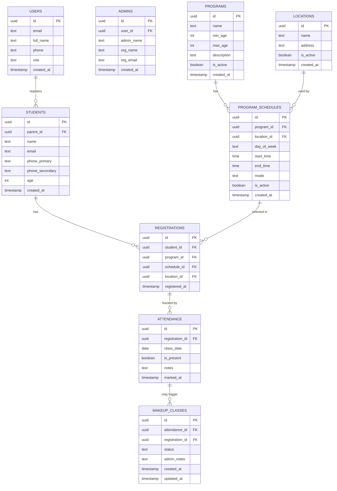

# Database Schema — Student Registration App

## 1. Overview

This document defines the PostgreSQL database schema hosted on **Supabase**. It covers all tables, their fields, relationships, and constraints. Supabase Auth handles user authentication separately — this schema covers application data only.

---

## 2. Entity-Relationship Diagram

---

## 3. Table Definitions

### 3.1 `users`

Stores basic profile data for all authenticated users. Linked to Supabase Auth via `id`.

| Column | Type | Constraints | Description |
|---|---|---|---|
| `id` | `UUID` | PK, default `gen_random_uuid()` | Matches Supabase Auth user ID |
| `email` | `VARCHAR(255)` | UNIQUE, NOT NULL | User's email address |
| `full_name` | `VARCHAR(100)` | NOT NULL | User's display name |
| `phone` | `VARCHAR(20)` | | Contact phone number |
| `role` | `VARCHAR(10)` | NOT NULL, CHECK (`parent`, `admin`) | Role-based access control |
| `created_at` | `TIMESTAMPTZ` | DEFAULT `NOW()` | Account creation timestamp |

> [!NOTE]
> The `id` field should match the Supabase Auth `auth.users.id` so we can join auth data with profile data seamlessly.

---

### 3.2 `admins`

Extended profile data for admin users. Max 5 admin accounts for the POC.

| Column | Type | Constraints | Description |
|---|---|---|---|
| `id` | `UUID` | PK, default `gen_random_uuid()` | Admin record ID |
| `user_id` | `UUID` | FK → `users.id`, UNIQUE, NOT NULL | Link to base user record |
| `admin_name` | `VARCHAR(100)` | NOT NULL | Admin's full name |
| `org_name` | `VARCHAR(200)` | NOT NULL | Organization name |
| `org_email` | `VARCHAR(255)` | NOT NULL | Organization email |
| `created_at` | `TIMESTAMPTZ` | DEFAULT `NOW()` | Record creation timestamp |

---

### 3.3 `students`

Stores student information submitted by parents via the registration form. A parent can register multiple students.

| Column | Type | Constraints | Description |
|---|---|---|---|
| `id` | `UUID` | PK, default `gen_random_uuid()` | Student record ID |
| `parent_id` | `UUID` | FK → `users.id`, NOT NULL | Parent who registered this student |
| `name` | `VARCHAR(100)` | NOT NULL | Student's full name |
| `email` | `VARCHAR(255)` | | Student's email (if applicable) |
| `phone_primary` | `VARCHAR(20)` | NOT NULL | Primary contact phone |
| `phone_secondary` | `VARCHAR(20)` | | Optional secondary phone |
| `age` | `INTEGER` | NOT NULL, CHECK (`age > 0`) | Student's age |
| `created_at` | `TIMESTAMPTZ` | DEFAULT `NOW()` | Record creation timestamp |

---

### 3.4 `programs`

Available programs/courses. Seeded initially, admin can add more. Programs are filtered by student age.

| Column | Type | Constraints | Description |
|---|---|---|---|
| `id` | `UUID` | PK, default `gen_random_uuid()` | Program ID |
| `name` | `VARCHAR(200)` | NOT NULL | Program name (e.g., "Piano Basics") |
| `min_age` | `INTEGER` | NOT NULL | Minimum eligible age |
| `max_age` | `INTEGER` | NOT NULL | Maximum eligible age |
| `description` | `TEXT` | | Program description |
| `is_active` | `BOOLEAN` | DEFAULT `TRUE` | Soft-delete / deactivation flag |
| `created_at` | `TIMESTAMPTZ` | DEFAULT `NOW()` | Record creation timestamp |

---

### 3.5 `program_schedules`

Defines when and where a program is offered. Each row = one time slot on a specific day for a specific program.

| Column | Type | Constraints | Description |
|---|---|---|---|
| `id` | `UUID` | PK, default `gen_random_uuid()` | Schedule ID |
| `program_id` | `UUID` | FK → `programs.id`, NOT NULL | Which program |
| `location_id` | `UUID` | FK → `locations.id`, NULLABLE | Location (NULL if online-only) |
| `day_of_week` | `VARCHAR(10)` | NOT NULL, CHECK (valid day) | Day: Monday–Sunday |
| `start_time` | `TIME` | NOT NULL | Slot start time |
| `end_time` | `TIME` | NOT NULL | Slot end time |
| `mode` | `VARCHAR(15)` | NOT NULL, CHECK (`online`, `in_person`) | Class delivery mode |
| `is_active` | `BOOLEAN` | DEFAULT `TRUE` | Whether this slot is currently available |
| `created_at` | `TIMESTAMPTZ` | DEFAULT `NOW()` | Record creation timestamp |

> [!IMPORTANT]
> A single program can have both online and in-person slots on the same day. Each gets its own row in this table.

---

### 3.6 `locations`

Available physical locations for in-person classes.

| Column | Type | Constraints | Description |
|---|---|---|---|
| `id` | `UUID` | PK, default `gen_random_uuid()` | Location ID |
| `name` | `VARCHAR(200)` | NOT NULL | Location name (e.g., "Downtown Center") |
| `address` | `TEXT` | | Full address |
| `is_active` | `BOOLEAN` | DEFAULT `TRUE` | Whether location is active |
| `created_at` | `TIMESTAMPTZ` | DEFAULT `NOW()` | Record creation timestamp |

---

### 3.7 `registrations`

Links a student to a specific program schedule. Represents a completed registration form submission.

| Column | Type | Constraints | Description |
|---|---|---|---|
| `id` | `UUID` | PK, default `gen_random_uuid()` | Registration ID |
| `student_id` | `UUID` | FK → `students.id`, NOT NULL | Which student |
| `program_id` | `UUID` | FK → `programs.id`, NOT NULL | Which program |
| `schedule_id` | `UUID` | FK → `program_schedules.id`, NOT NULL | Selected time slot |
| `location_id` | `UUID` | FK → `locations.id`, NULLABLE | Location (if in-person) |
| `registered_at` | `TIMESTAMPTZ` | DEFAULT `NOW()` | Registration timestamp |

**Unique constraint**: `(student_id, program_id)` — a student can only register for one program once (one time slot per program).

---

### 3.8 `attendance`

Tracks attendance per student per class session. Admin marks this.

| Column | Type | Constraints | Description |
|---|---|---|---|
| `id` | `UUID` | PK, default `gen_random_uuid()` | Attendance record ID |
| `registration_id` | `UUID` | FK → `registrations.id`, NOT NULL | Which registration |
| `class_date` | `DATE` | NOT NULL | The date of the class |
| `is_present` | `BOOLEAN` | NOT NULL | Whether student attended |
| `notes` | `TEXT` | | Admin notes (reason for absence, etc.) |
| `marked_at` | `TIMESTAMPTZ` | DEFAULT `NOW()` | When attendance was recorded |

**Unique constraint**: `(registration_id, class_date)` — one attendance record per student per class date.

---

### 3.9 `makeup_classes`

Tracks makeup/cover-up classes for students who missed sessions.

| Column | Type | Constraints | Description |
|---|---|---|---|
| `id` | `UUID` | PK, default `gen_random_uuid()` | Makeup class record ID |
| `attendance_id` | `UUID` | FK → `attendance.id`, UNIQUE, NOT NULL | The missed class this covers |
| `registration_id` | `UUID` | FK → `registrations.id`, NOT NULL | Student's registration |
| `status` | `VARCHAR(20)` | NOT NULL, DEFAULT `PENDING` | Current status |
| `admin_notes` | `TEXT` | | Admin notes on approval/scheduling |
| `created_at` | `TIMESTAMPTZ` | DEFAULT `NOW()` | Record creation timestamp |
| `updated_at` | `TIMESTAMPTZ` | DEFAULT `NOW()` | Last status change timestamp |

**Status values:**

| Status | Meaning |
|---|---|
| `PENDING` | Makeup class hasn't happened yet |
| `APPROVAL_PENDING` | Student had a genuine reason; awaiting admin review |
| `APPROVED` | Admin approved; teacher will assign a makeup slot |
| `COMPLETE` | Makeup class has been completed |

**Business rule**: 1 missed class → 1 makeup class (1:1 relationship via `attendance_id` UNIQUE constraint).

---

## 4. Indexes

| Table | Index | Columns | Purpose |
|---|---|---|---|
| `students` | `idx_students_parent` | `parent_id` | Fast lookup of all students by parent |
| `programs` | `idx_programs_age` | `min_age, max_age` | Age-based program filtering |
| `program_schedules` | `idx_schedules_program` | `program_id` | Schedule lookup by program |
| `registrations` | `idx_registrations_student` | `student_id` | All registrations for a student |
| `attendance` | `idx_attendance_registration` | `registration_id` | Attendance history per registration |
| `makeup_classes` | `idx_makeup_status` | `status` | Filter makeup classes by status |

---

## 5. Seed Data Requirements

The following tables require initial seed data for the app to function:

1. **`admins`** — up to 5 admin accounts (with corresponding `users` entries, role = `admin`)
2. **`programs`** — available programs with age ranges
3. **`locations`** — available physical locations
4. **`program_schedules`** — initial time slots per program per day
