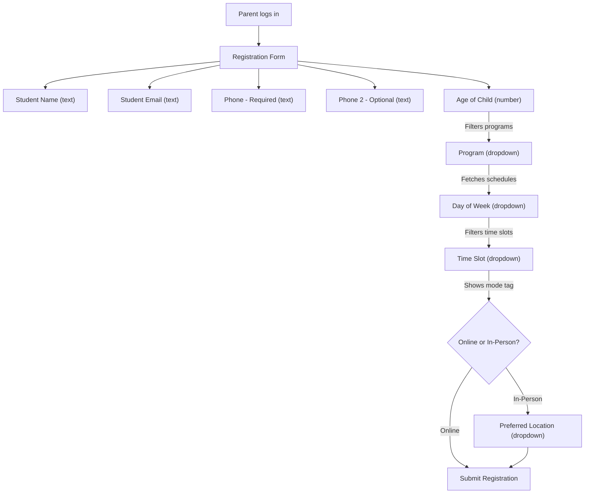
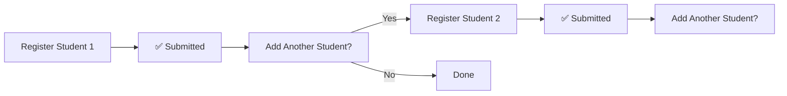

# Student Registration Flow — Student Registration App

## 1. Overview

The registration form is the **core feature for parents**. It uses a **cascading dropdown** pattern where each selection filters the options for the next field. This document covers the form structure, data dependencies, validation rules, and client-side caching strategy.

---

## 2. Form Flow Diagram



---

## 3. Form Fields (in order)

| # | Field | Type | Required | Depends On | Notes |
|---|---|---|---|---|---|
| 1 | Student Name | Text input | ✅ | — | Full name |
| 2 | Student Email | Text input | ❌ | — | Optional |
| 3 | Phone (Primary) | Text input | ✅ | — | Primary contact |
| 4 | Phone (Secondary) | Text input | ❌ | — | Optional backup |
| 5 | Age of Child | Number input | ✅ | — | Determines program options |
| 6 | Program | Dropdown | ✅ | Age | Filtered by `min_age <= age <= max_age` |
| 7 | Day of Week | Dropdown | ✅ | Program | Shows days with available slots |
| 8 | Time Slot | Dropdown | ✅ | Program + Day | Each slot tagged with mode |
| 9 | Location | Dropdown | Conditional | Time Slot mode | Required only if mode = `in_person` |

---

## 4. Cascading Logic — Step by Step

### Step 1: Parent enters Age

When the parent enters the child's age:

```
API Call: GET /api/v1/programs?age={childAge}
Cache:   Store result in memory (programs rarely change)
Result:  Populate the Program dropdown with eligible programs
```

### Step 2: Parent selects a Program

When a program is selected:

```
API Call: GET /api/v1/programs/{programId}/schedules
Cache:   Store result in memory
Result:  Extract unique days of the week → Populate Day dropdown
```

### Step 3: Parent selects a Day of Week

When a day is selected:

```
No API call needed (data already cached from Step 2)
Filter:  schedules.filter(s => s.day_of_week === selectedDay)
Result:  Populate Time Slot dropdown with available slots
         Each slot displays: "4:00 PM – 5:00 PM (Online)" or "4:00 PM – 5:00 PM (In-Person)"
```

### Step 4: Parent selects a Time Slot

When a time slot is selected:

```
Check:   slot.mode === 'in_person' ?
  Yes → Show Location dropdown (GET /api/v1/locations — cached on form load)
  No  → Hide Location field, ready to submit
```

### Step 5: Submit

```
API Call: POST /api/v1/registrations
Body:    { student_id, program_id, schedule_id, location_id }
```

> [!NOTE]
> If the student record doesn't exist yet (first registration), the form first calls `POST /api/v1/students` to create the student, then `POST /api/v1/registrations`.

---

## 5. Cascading Dependency Diagram

```mermaid
graph LR
    AGE["Age Input"] -->|GET /programs?age=X| PROGRAMS["Programs Cache"]
    PROGRAMS -->|User selects one| PROG_SELECT["Selected Program"]
    PROG_SELECT -->|GET /programs/:id/schedules| SCHEDULES["Schedules Cache"]
    SCHEDULES -->|Filter by day| DAYS["Available Days"]
    DAYS -->|User selects day| SLOTS["Available Time Slots"]
    SLOTS -->|User selects slot| MODE_CHECK{"Mode?"}
    MODE_CHECK -->|in_person| LOCATIONS["Locations Cache"]
    MODE_CHECK -->|online| READY["Ready to Submit"]
    LOCATIONS -->|User selects location| READY
```



---

## 6. Client-Side Caching Strategy

### What gets cached

| Data | Cache Key | Fetched When | Invalidated When |
|---|---|---|---|
| Programs (by age) | `programs_age_{age}` | Age field changes | App restart or manual refresh |
| Schedules (by program) | `schedules_program_{id}` | Program selected | Different program selected |
| Locations | `locations_all` | Form opens | App restart or manual refresh |

### Caching implementation

```
┌─────────────────────────────────────┐
│         In-Memory Cache             │
│  (client/src/cache/formCache.js)    │
│                                     │
│  programs: Map<age, Program[]>      │
│  schedules: Map<programId, Sched[]> │
│  locations: Location[]              │
└─────────────────────────────────────┘
```

**Rules:**
- Cache is **in-memory only** — cleared when the app restarts
- When the parent changes the **age**, the program cache for the new age is fetched (if not already cached)
- When the parent changes the **program**, the schedule cache for the new program is fetched (if not already cached)
- **Locations** are fetched once when the form loads and reused across all registrations

---

## 7. Multi-Student Registration

A parent can register **multiple students** sequentially:



- After each submission, the form resets but **caches are preserved**
- The parent can see their submitted registrations via `GET /registrations/mine`

---

## 8. Validation Rules

| Field | Validation | Error Message |
|---|---|---|
| Student Name | Non-empty, max 100 chars | "Name is required" |
| Email | Valid email format (if provided) | "Invalid email format" |
| Phone (Primary) | Non-empty, valid phone format | "Primary phone is required" |
| Age | Positive integer > 0 | "Please enter a valid age" |
| Program | Must be selected | "Please select a program" |
| Day of Week | Must be selected | "Please select a day" |
| Time Slot | Must be selected | "Please select a time slot" |
| Location | Required if mode = `in_person` | "Please select a location" |

**Validation happens on both client (React Native) and server (Express middleware).**

---

## 9. Edge Cases

| Case | Behavior |
|---|---|
| No programs match the student's age | Show message: "No programs available for this age group" |
| No schedules available for a program | Show message: "No available slots for this program" |
| Duplicate registration (same student + program) | Backend returns `409 Conflict` |
| Form submitted while offline | Show error, retry when online (no offline queue for POC) |
